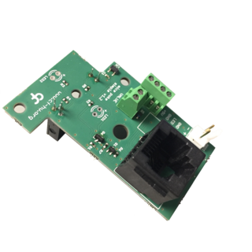

# Peripheral - Mice Poke

## General description

----

[//]: # (Tables can be generated using: https://www.tablesgenerator.com/markdown_tables)

## Hardware compatibility

| Peripheral HW Version 	| Board           	                                                | Board HW Version 	| Notes                            	|
|-----------------------	|-----------------	                                                |------------------	|----------------------------------	|
| **1.3**                 | [Device.Behavior](https://github.com/harp-tech/device.behavior) 	| > 1.0             |                                	|
| **1.2**                 | [Device.Behavior](https://github.com/harp-tech/device.behavior)   | > 1.0             |                                	|
|                       	|                 	                                                |                  	|                                  	|
----

## Key Features

* Poke detection through an infrared beam
* Control of 2 LEDs + an external LED
* 12V valve control when connected to an Harp Behavior

----

## Connectivity [v1.3]

* 1x 12V Valve [screw terminal]  
* 1x DIO, IR LED, IR Photodiode, LED, 5V, GND  [screw terminal] 

----

## Licensing

License files can be found, and are applied to, each individual subfolder in this repository.
